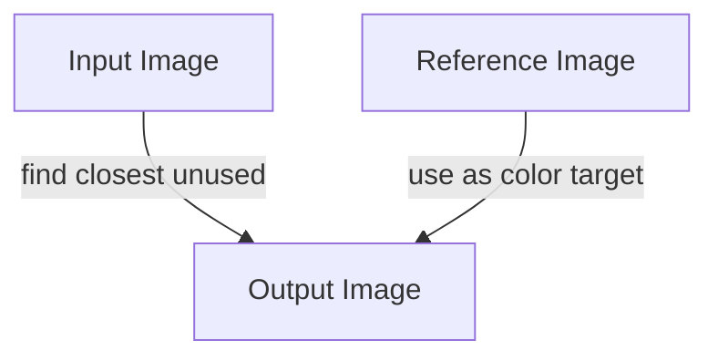

# Luminix

[](LICENSE)
[]()
[]()
[]()

Luminix rearranges every pixel from an input image to match the color pattern of a reference image.  
Each output pixel is the closest possible match, using each input pixel at most once.

This project is in its initial trial and error stage.

---

## How It Works

For each pixel in the reference image, Luminix finds the unused input pixel that is closest in color.  
It moves that input pixel to the output at the corresponding position.  
Each input pixel is used at most once.



---

## Usage

**Build:**
```sh
gcc main.c luminix.c -o luminix -lm
```

**Run:**
```sh
./luminix input.png reference.png output.png
```

- `input.png`: The image to rearrange.
- `reference.png`: The reference for color pattern.
- `output.png`: The output file.

---

## What to Expect

- Each input pixel is used at most once.
- The output image will look like the reference image, using only pixels from the input.
- The process uses a greedy, color-based assignment.

---

## References

- **Color Transfer between Images**, Erik Reinhard, Michael Ashikhmin, Bruce Gooch, Peter Shirley. IEEE Computer Graphics and Applications, 2001.
- **Digital Image Processing**, Rafael C. Gonzalez and Richard E. Woods. (See "Histogram Specification (Histogram Matching)".)
- **Image Analogies**, Aaron Hertzmann et al., SIGGRAPH 2001.
- **A Neural Algorithm of Artistic Style**, Leon A. Gatys et al., arXiv 2015 / CVPR 2016.

---

## License

MIT
